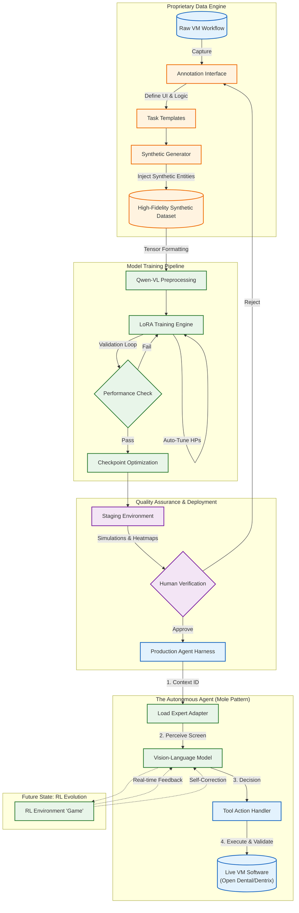

# Technical Architecture: Autonomous Dental Revenue Cycle Management (RCM)

## 1. Executive Summary
We have developed a proprietary autonomous agent designed to revolutionize dental billing. By replicating the cognitive and mechanical workflows of human billers, our system interacts directly with legacy dental software (Open Dental, Dentrix, Vyne, etc.) via Virtual Machines.

Unlike traditional automation that relies on brittle scripts, our architecture utilizes **Computer Vision** and **Large Language Models (LLMs)**. The system is built on a foundation of privacy-preserving synthetic data, allowing for infinite scalability without compromising Patient Health Information (PHI). We are currently evolving from a high-accuracy Supervised Learning (SL) foundation toward a self-correcting Reinforcement Learning (RL) ecosystem.

---

## 2. The Core Architecture: The "Mole" Expert System

To achieve human-level reliability, we avoid using a single, distinct "black box" model. Instead, we utilize a modular **Expert Adapter Pattern** (internally referred to as the "Mole" architecture).

### 2.1 The Agent Workflow
The agent operates as a digital employee within a virtualization layer. Its cognitive process follows a distinct loop:
1.  **Perception:** The agent ingests a screenshot of the current VM state along with a specific text prompt.
2.  **Cognition:** The model processes visual and textual data to determine the necessary action (e.g., "Select Patient Ledger," "Input Procedure Code").
3.  **Action:** The system executes precise `tool_calls` (mouse clicks, keystrokes, scrolling) handled by our proprietary Agent Harness.
4.  **Validation:** Specialized verification tools run in parallel to "read" the screen and validate that the action had the intended effect (e.g., verifying a claim status changed to "Submitted").

### 2.2 Context-Aware Routing
Rather than relying on slow, resource-heavy Mixture-of-Experts (MoE) routers, our **Agent Harness** utilizes deterministic context tracking. The Harness identifies the active screen or software module and dynamically activates the specific "Mole" (LoRA adapter) trained for that exact interface. This ensures maximum accuracy with minimal computational latency.

---

## 3. Proprietary Data Engineering Stack

The competitive moat of our technology is our **Synthetic Data Pipeline**. We do not train on raw patient data, thereby eliminating HIPAA risks and data sparsity issues.

### 3.1 The Annotation Engine
We utilize a custom-built web platform to digitize human expertise:
*   **Visual Structuring:** Human annotators import screenshots of billing workflows, cropping and masking sensitive areas.
*   **Element Definition:** UI components (buttons, grids, scrollbars) are visually defined and tagged.
*   **OCR & Semantic Mapping:** We utilize Optical Character Recognition (OCR) snapshots to convert pixel-based text into structured data objects.
*   **Task Templating:** Visual elements are bound to "Tasks"—logic templates that serve as the ground truth for model training.

### 3.2 The Generative Forge
Once a screen is annotated, it is passed to our **Dataset Generator**.
*   **Infinite Variations:** The generator synthesizes thousands of unique scenarios based on the single annotated template.
*   **Synthetic Injection:** It replaces masked data with hallucination-free synthetic entities (fictitious patients, doctors, and financial ledgers) that maintain the visual "qualia" and statistical distribution of real-world data.
*   **Tensor Optimization:** This synthetic dataset is pre-processed and tokenized specifically for **Qwen-VL (Vision-Language)** tensor formats to maximize training throughput.

---

## 4. Training & Quality Assurance Pipeline

Our training infrastructure is designed for continuous integration and deployment (CI/CD) of intelligence.

### 4.1 Automated Training
The pre-processed tensors feed into a common **LoRA (Low-Rank Adaptation)** training engine featuring:
*   **Auto-Tuning:** Hyperparameters adjust dynamically based on dataset volume and complexity.
*   **Performance Guardrails:** Training utilizes early stopping (patience factor of 3) based on validation loss to prevent overfitting.
*   **Checkpointing:** The system automatically preserves the top 5 model weights for comparative analysis.

### 4.2 Evaluation & Deployment
*   **Out-of-Sample Testing:** Models are rigorously tested against "unseen" synthetic data to calculate accuracy percentages on novel scenarios.
*   **Staging & Visualization:** Successful candidates are auto-deployed to a staging environment. Engineers review performance using generated attention heatmaps and workflow simulators.
*   **Production Release:** Upon human approval, updated weights are pushed to the production Agent Harness.

---

## 5. Future State: The Reinforcement Learning (RL) Evolution

We are currently advancing our stack from Supervised Learning (mimicking humans) to Reinforcement Learning (super-human optimization).

*   **Gamification of Work:** The billing workflow is being refactored into a real-time "game" environment.
*   **Self-Correction:** In this fully synthetic environment, the model is rewarded for successful claim submissions and penalized for errors.
*   **Closed-Loop Learning:** The agent learns to navigate edge cases, correct its own typos, and handle unexpected software pop-ups without human intervention. This transition marks the shift from an automated tool to a fully autonomous agent.

---

## 6. System Architecture Diagram

Below is the visual representation of the data and logic flow, from raw annotation to the production autonomous agent.

